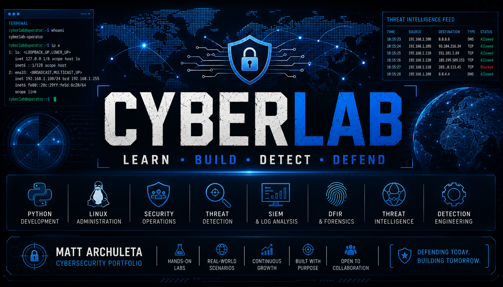

<p align="center">
  
</p>

<h1 align="center">🛡️ CyberLab</h1>

<p align="center">
  <strong>Professional Cybersecurity Portfolio</strong><br>
  Learn • Build • Detect • Defend
</p>

---

# Welcome

CyberLab is my hands-on cybersecurity portfolio documenting my journey through offensive security, defensive operations, automation, detection engineering, and SOC analysis.

Every project is designed to strengthen practical cybersecurity skills while following professional documentation and GitHub best practices.

---

# About Me

Hello, I'm **Matt Archuleta**.

I'm a cybersecurity professional with leadership experience and a passion for continuous learning. CyberLab is where I build, document, and share practical projects that demonstrate security concepts, scripting, investigation techniques, and defensive operations.

My focus includes:

- Security Operations Center (SOC)
- Threat Detection
- Detection Engineering
- Incident Response
- Network Security
- Python Automation
- Linux Administration

---

# Technology Stack

| Category | Technologies |
|-----------|--------------|
| Languages | Python, Bash |
| Operating Systems | Ubuntu Linux, Windows 11 |
| Networking | TCP/IP, DNS, HTTP, HTTPS, SSL/TLS |
| Security Tools | Splunk, Wireshark, Git, VS Code |
| Platforms | GitHub, Virtual Labs |
| Documentation | Markdown |

---

# Featured Projects

| Project | Focus |
|---------|-------|
| System Check | Linux Enumeration |
| Port Scanner | Network Reconnaissance |
| Banner Grabber | Service Identification |
| DNS Lookup | DNS Investigation |
| WHOIS Lookup | Open Source Intelligence |
| HTTP Header Analyzer | Web Security |
| SSL Certificate Inspector | TLS Security |
| File Integrity Monitor | File Monitoring |
| Password Strength Analyzer | Authentication |
| IOC Scanner | Threat Detection |
| Log Analyzer | Security Monitoring |

---

# Project Catalog

## Python

- 01 – System Check
- 02 – Port Scanner
- 03 – Banner Grabber
- 04 – DNS Lookup
- 05 – Ping Sweep
- 06 – WHOIS Lookup
- 07 – Subdomain Enumerator
- 08 – HTTP Header Analyzer
- 09 – SSL Certificate Inspector
- 10 – File Integrity Monitor
- 11 – Password Strength Analyzer
- 12 – Coming Soon
- 13 – Coming Soon
- 14 – Web Technology Fingerprinter
- 15 – IOC Scanner
- 16 – Log Analyzer
- 17–30 – In Development

---

# Repository Structure

```
CyberLab/
├── docs/
├── Linux/
├── Logs/
├── Networking/
├── PacketCaptures/
├── PacketTracer/
├── Python/
├── Reports/
├── SOC/
├── Splunk/
├── Tools/
└── Wordlists/
```

---

# Current Learning Roadmap

## Completed

- Linux Fundamentals
- Python Automation
- Network Reconnaissance
- HTTP Analysis
- SSL/TLS Inspection
- IOC Detection
- Log Analysis

## In Progress

- PCAP Analysis
- Threat Intelligence
- Detection Engineering
- Splunk Dashboards
- Threat Hunting
- Incident Response

## Planned

- YARA Rules
- Sigma Rules
- Malware Analysis
- Active Directory
- Mini SIEM
- GitHub Actions Automation

---

# Certifications

- CompTIA Security+
- CompTIA CASP+
- EC-Council Certified Ethical Hacker (CEH)
- Splunk Core Certified User
- Splunk Core Certified Power User

---

# Mission

CyberLab exists to demonstrate practical cybersecurity skills through real projects, clear documentation, and continuous improvement.

Every repository is designed to answer one question:

**Can this project demonstrate a skill that would be valuable in a professional Security Operations Center?**

---

# Connect

- GitHub: https://github.com/Archulet50
- LinkedIn: *(Add your LinkedIn URL here.)*

---

⭐ If you find this repository useful or interesting, consider giving it a star.